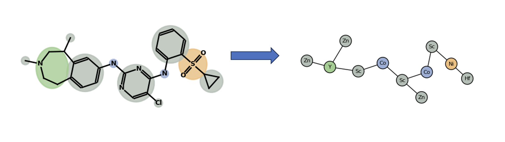
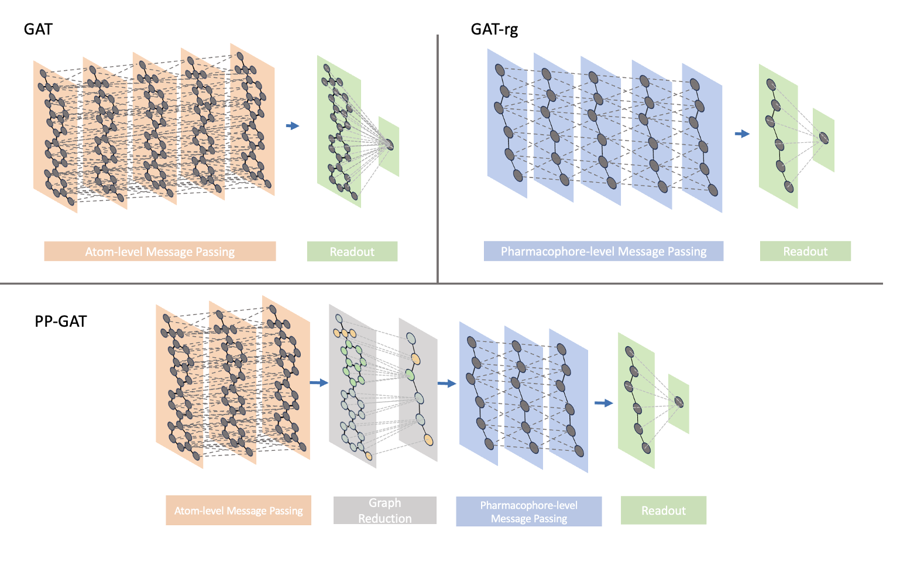

# Pharmacophore Pooling Graph Neural Networks for Molecular Property Prediction

This repository contains the code used for pharmacophore-based graph reduction and hierarchical pooling graph neural networks (GNNs) for molecular property prediction.

The project includes pipelines for:
- Converting SMILES datasets into PyTorch Geometric datasets
- Constructing pharmacophore-based reduced graphs
- Training Graph Attention Networks (GAT) and Pharmacophore Pooling Graph Attention Networks (PP-GAT)
- Hyperparameter optimization and model selection per protein target
- Explainability analysis using GNNExplainer and EdgeSHAPer and computation of Minimal Informative Sets (MIS)
- Ablation study

# Graph Reduction

The file `reducegraph.py` contains functions for constructing pharmacophore-based reduced graphs from molecular structures.

It includes functions to generate NetworkX reduced graphs and PyTorch Geometric reduced graphs

These graphs represent pharmacophoric features and their interactions within a molecule.

# Model Architectures
Implemented in `networks.py`.

### Graph Attention Network (GAT)

This model represents a standard Graph Attention Network operating on molecular graphs or reduced graphs.

### Pharmacophore Pooling Graph Attention Network (PP-GAT)

This architecture introduces a hierarchical pooling mechanism that:

1. Processes atom-level molecular graphs
2. Pools nodes into pharmacophore-level representations
3. Performs message passing on the reduced graph

# Notebooks

## Dataset Preparation

The datasets notebook converts molecular datasets containing SMILES strings into PyTorch Geometric objects.

Three dataset are generated:

1. Standard Molecular Graph Dataset  
   Atom-level representation used for training the baseline GAT model.

2. Reduced Graph Dataset  
   Molecules converted into pharmacophore-based reduced graphs used for GAT-mol.

3. Pharmacophore Pooling Dataset  
   Includes pooling tensors mapping atom-level nodes to pharmacophore nodes and is used for the PP-GAT hierarchical pooling model.
   
## Hyperparameter Optimization

The notebook `hyperparameter_opt` performs hyperparameter tuning for each protein target.

The training pipeline also includes functionality to:

- save the best performing model
- store model checkpoints
- record performance metrics

## Explainability Analysis

Explainability is analyzed using two methods:

## GNNExplainer

Identifies important subgraphs and node features that influence model predictions.

## EdgeSHAPer

Computes edge importance scores based on Shapley value approximations.

The explainability workflow includes:

- generation of explanations
- visualization on reduced graphs
- comparison of explanations across different model architectures

## Minimal Informative Sets (MIS)

The repository implements a framework for analyzing Minimal Informative Sets of molecular substructures.

Three sets are computed:

PPOS (Pertinent Positive Set)  
The smallest subset of features that preserves the model prediction.

TK (Top-k set)  
The k most important features or substructures according to the explanation method.

MO (Minimal Opposing Set)  
The smallest subset of features whose removal changes the prediction.

These sets allow comparison of the reasoning behavior of different model architectures.

## Ablation Study

The ablation experiments analyze the contribution of individual components of the PP-GAT architecture.

Implemented in `ablation_study.py`.

# Requirements

Dependencies can be installed with:

pip install -r requirements.txt

# Citation

